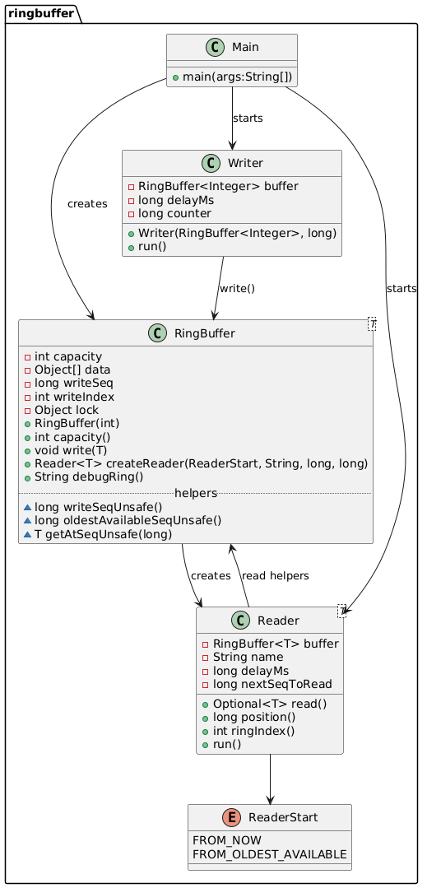
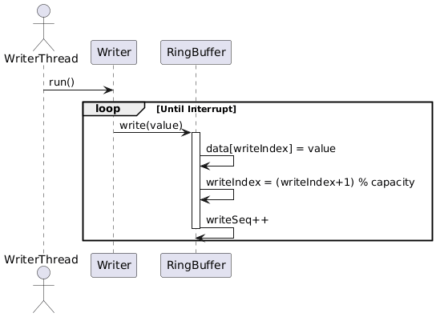
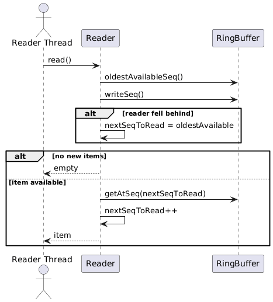

# Ring Buffer (Single Writer, Multiple Readers)

## 
A fixed-size ring buffer (capacity **N**) loop with:
- a CLI to declare capacity N as well as visualize the buffer
- one writer
- multiple readers
- each reader has its own cursor
- reads do not delete items for other readers
- when full, the writer overwritesold data (slow readers may miss items)
- readers are in different initial positions (offset) -- can be changed for liking

## Design 
- **RingBuffer<T>**
  - owns the fixed array and capacity
  - writes using a circular `writeIndex`
  - keeps a `writeSeq` counter so readers can detect overwrite
  - creates readers (chooses their start position)
- **Writer**
  - the only component that calls `write()`
  - runs in its own thread and writes increasing numbers
- **Reader<T>**
  - has its own `nextSeqToRead`
  - `read()` returns the next item for that reader
  - if it fell behind (overwritten), it skips forward
- **ReaderStart**
  - `FROM_NOW` or `FROM_OLDEST_AVAILABLE`

## Run
Compile:
```bash
javac -d out ringbuffer/*.java

java -cp out ringbuffer.Main {N}
```
### To exit the ringbuffer loop, use keyboardInterrupt (CTRL + C) 
### ***It is recommended to run the loop for a short amount of time***
### ***~= 4-5 seconds***
### ***to avoid too much noise in the CLI***


## UML Diagrams 


### UML Class Diagram 



### Sequence diagram for write


### Sequence diagram for read
